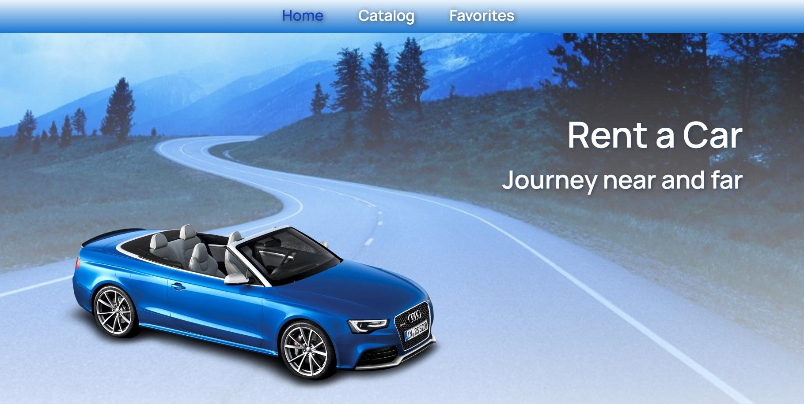

# Car Rental

This is a car rental agency website that allows users to choose a suitable car,
filter models based on specific criteria, and create a list of favorite models.

## Features

- Explore a catalog of cars
- Filter cars based on various criteria (brand, price, mileage)
- Save selected cars as favorites
- Enable pagination for browsing through the car list

## Technologies used:

- React.js
- Redux Toolkit
- Styled Components
- MockAPI

## Live page

The live page can be accessed through the following link:
https://olena-rudnieva.github.io/car-rental/

## Test Task

Create an application for a company providing car rental services in Ukraine.
The application consists of three pages:

- Home page with a general description of the services offered by the company.
  Styling and design are at your discretion.

- Catalog page featuring cars of various configurations. Users can filter cars
  by brand, hourly rental price, and mileage covered during usage.

- Advertisements page displaying ads added by the user in favorites. The
  program's appearance should include navigation (styled at your discretion) and
  a viewing area.
